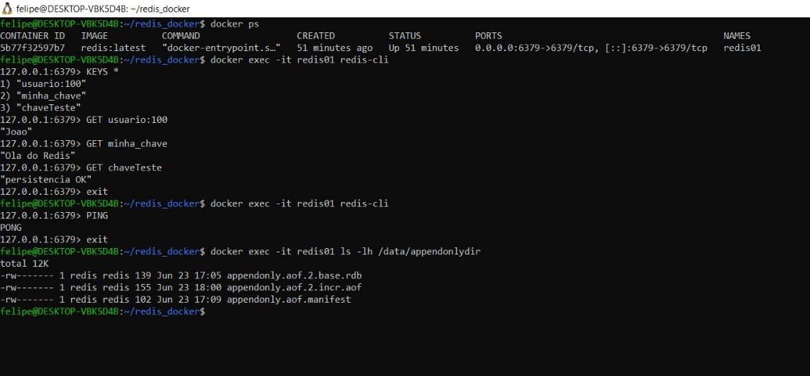

# Documentação do Projeto – Docker + Redis

## 1. Nome dos Integrantes e Serviço Sorteado

* **Integrantes**:

  * Felipe Werneck
  * João Francisco

---

## 2. Explicação Breve e Clara sobre o Serviço

O **Redis** é um banco de dados em memória, do tipo chave-valor, altamente performático. É comumente usado para:

* **Cache** de dados e sessões em aplicações web;
* **Filas** simples e sistemas de Pub/Sub;
* **Contadores** e métricas em tempo real;
* **Dados temporários**, com suporte a expiração automática.

Sua principal vantagem é a baixa latência e alta taxa de operações por segundo, sendo ideal em cenários que não suportam latências elevadas.

O Docker isola os ambientes para aplicativos e serviços que são executados dentro de contêineres. O isolamento significa que é possível empacotar, criar e enviar imagens do Redis que funcionam independentemente do sistema operacional do host, o que facilita o desenvolvimento e a execução de aplicativos Redis dentro do Docker. Além da facilidade de uso, essa abordagem também oferece segurança, flexoflexibilidade e confiabilidade.

---

## 3. Instruções de Instalação do Docker e Docker Compose (Ubuntu 22.04 / WSL2)

Neste ambiente WSL2, o Docker foi instalado via **snap** e a extensão WSL2 foi configurada manualmente. Confira o histórico de comandos utilizados:

```bash
# Atualizar e verificar WSL2
sudo apt-get update
sudo apt-get upgrade
wsl -l -v                   # lista distribuições e versões
wsl --version               # verifica versão do WSL

# Caso precise, instalar o WSL2 manualmente
sudo apt install wsl
wsl --version

# Instalar Docker via snap
sudo snap install docker   # instala Docker Engine usando Snap (um sistema de pacotes universal do Ubuntu, que gerencia versões e dependências isoladas em contêineres leves)

# Verificar instalação e versões
docker --version           # ex.: Docker version XX.X.X
docker compose version     # ex.: Docker Compose version v2.X.X

# Execução de um container de teste
docker run hello-world
```

---

## 4. Arquivo `docker-compose.yml` Comentado

Crie um diretório `redis-docker/` e, dentro, o arquivo `docker-compose.yml`:

```yaml
version: '3.8'                # 1. Versão da sintaxe do Compose
services:
  redis:                      # 2. Definição do serviço "redis"
    image: redis:latest       # 3. Imagem Docker (tag latest)
    container_name: redis01   # 4. Nome do container
    ports:
      - "6379:6379"          # 5. Mapeia porta TCP do host para o container
    volumes:
      - redis-data:/data       # 6. Volume nomeado para persistência em /data
    restart: unless-stopped    # 7. Política de reinício automática
    command:                  # 8. Comando customizado para habilitar AOF
      - redis-server
      - --appendonly        # ativa o modo AOF (Append Only File), que grava todas as operações de escrita em disco
      - yes                # garante persistência mesmo após queda ou reinício do container

volumes:
  redis-data:                 # 9. Declaração do volume nomeado
    driver: local             #    driver local padrão
```

---

## 5. Comandos Utilizados para Execução e Testes

Os seguintes comandos do Docker e Docker Compose foram utilizados e compreendidos durante a execução do projeto:

* `docker compose up -d`: sobe o serviço Redis em segundo plano (modo "detached").
* `docker ps`: lista todos os containers em execução no momento.
* `docker logs <container>`: exibe os logs do container (opcional para depuração).
* `docker exec -it <container> <comando>`: executa um comando interativo dentro do container. Usamos para acessar o Redis via `redis-cli`.
* `docker compose down -v`: derruba os containers e remove os volumes associados (limpa completamente o ambiente).


```bash
cd redis-docker
# Inicia o container em background
docker compose up -d

# Lista containers ativos
docker ps

# Teste de conexão via CLI
docker exec -it redis01 redis-cli ping    # deve retornar PONG

# Teste de SET e GET (sem aspas extras)
docker exec -it redis01 redis-cli SET usuario:100 Joao
docker exec -it redis01 redis-cli GET usuario:100    # deve retornar "Joao"

# Verifica diretório de dados para persistência
docker exec -it redis01 ls -lh /data/appendonlydir

# Teste de Hashes (registro de objeto tipo "bike")
docker exec -it redis01 redis-cli HSET bike:2 model Deimos brand Ergonom type "Enduro bikes" price 4972

# Consultas ao Hash
docker exec -it redis01 redis-cli HGETALL bike:2
docker exec -it redis01 redis-cli HGET bike:2 price

# Para parar e remover tudo (containers, rede e volumes)
docker compose down -v
```

---

## 6. Prints do Serviço Funcionando



---

## 7. Dificuldades Encontradas e Soluções

* **Nome do arquivo Compose**: inicialmente uso de underscore (`docker_compose.yml`) em vez de hífen; corrigido para `docker-compose.yml`.
* **Criação de AOF**: Redis gravava dentro de `appendonlydir`; confirmei via `CONFIG GET dir` e `CONFIG GET appendfilename`, e forcei `BGREWRITEAOF` para gerar o arquivo.
* **Compreender como funciona**: Dúvidas em relação ao funcionamento do redis e docker, retiradas por meio de pesquisas.

---

## 8. Referências Utilizadas

* Docker Compose reference: [https://docs.docker.com/compose/](https://docs.docker.com/compose/)
* Redis persistence: [https://redis.io/topics/persistence](https://redis.io/topics/persistence)
* Kinsta tutorial: [https://kinsta.com/pt/blog/executar-redis-no-docker/]
